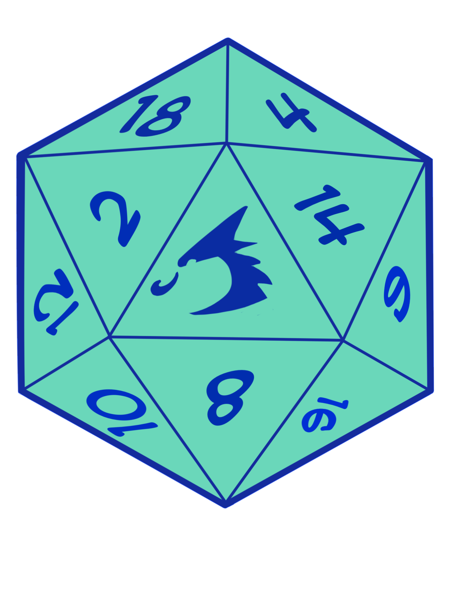
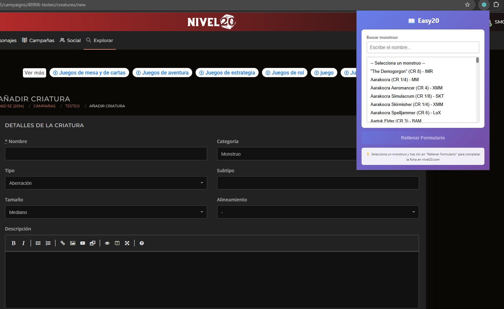
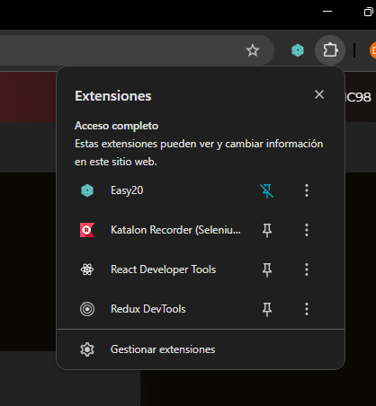
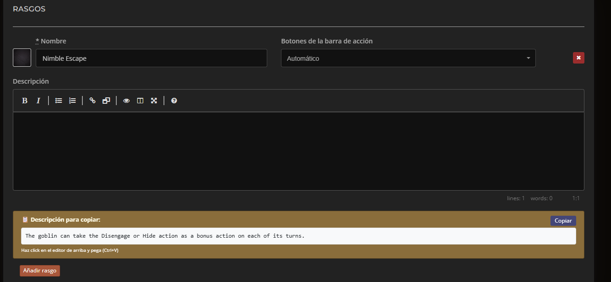

<!-- Header -->
<a id="logo">
 <figures>
 
  <figcaption>><a href="https://www.instagram.com/thirteight__?igsh=enBqMzhyaXRqNHc2&utm_source=qr" target="blank">Ilustración hecha por el artista 38</a></figcaption>
 </figures>
</a>
<h1>EASY20</h1>
Extensión para navegador que automatiza el rellenado de fichas de monstruos en <b>Nivel20</b>

Ahorra horas de trabajo manual importando criaturas de D&D con un solo click.

> **Aviso:** Esta extensión no es oficial ni está asociada a Nivel20, Wizards of the Coast o a alguno de sus terceros afiliados. Es un proyecto independiente para la comunidad.

---

## Características

### Criaturas en segundos

Rellena automáticamente la mayoría de campos de la ficha de monstruo en Nivel20 y acelera la adaptación de acciones y rasgos:

- ✅ Información básica (nombre, tipo, tamaño, alineamiento)
- ✅ Puntuaciones de característica (STR, DEX, CON, INT, WIS, CHA)
- ✅ Estadísticas de combate (CA, PG, CR, iniciativa)
- ✅ Velocidades (caminar, volar, nadar, etc.)
- ✅ Tiradas de salvación y habilidades
- ✅ Rasgos, acciones, acciones adicionales, reacciones
- ✅ Acciones legendarias y acciones míticas
- ✅ Spellcasting

### Compatible con D&D 2024

Puedes traer criaturas de bestiarios de 5e a tu campaña de D&D 2024 o traer criaturas de bestiarios de 2024 a tu campaña de 5e.

### Búsqueda Rápida

Encuentra cualquier monstruo en segundos con búsqueda instantánea.

### Copy-Paste Sencillo

Para campos no automatizables, la extensión proporciona cajas con el texto listo para copiar con un click.

<em>Popup con búsqueda de monstruos</em>

---

## Instalación

### Instalación Manual

La extensión actualmente se distribuye de forma manual mientras se prepara para las stores oficiales.

#### Chrome / Edge / Brave

1. **Descarga** el código:
   - [Última release](../../releases/latest) (recomendado)
   - O clona el repositorio: `git clone https://github.com/smc98/easy20.git`

2. **Abre Chrome** y ve a `chrome://extensions/`

3. **Activa el "Modo de desarrollador"** (esquina superior derecha)

4. **Click en "Cargar extensión descomprimida"**

5. **Selecciona la carpeta** de la extensión

6. **¡Listo!** La extensión aparecerá en tu barra de herramientas

<em>Pinea la extensión si quieres tenerla a mano</em>

#### Firefox

1. **Descarga** el código (igual que Chrome)

2. **Abre Firefox** y ve a `about:debugging#/runtime/this-firefox`

3. **Click en "Cargar complemento temporal..."**

4. **Selecciona el archivo** `manifest.json` de la carpeta de la extensión

5. **¡Listo!** La extensión está activa

> **Nota Firefox:** Los complementos temporales se desinstalan al cerrar Firefox. **Próximamente** se proveerá un método de instalación persistente mediante XPI firmado.

---

### Instalación Persistente (Próximamente)

Estamos trabajando en métodos de distribución permanente:

- ✅ **Firefox XPI firmado** - Instalación permanente de la extensión en local

**Mantente informado** siguiendo el repositorio o uniéndote a las [Discussions](../../discussions).

---

## Uso

### Abre Nivel20

Ve a [nivel20.com](https://nivel20.com) en una campaña que dirijas, ve a la pestaña "Bestiario" y dale a "Crear Nuevo".

### Abre la Extensión

Click en el icono de la extensión en tu navegador.

### Busca la criatura

Escribe el nombre en inglés (ej: "Goblin", "Ancient Red Dragon").

### Completa el Formulario

Click en "Rellenar Formulario" y espera unos segundos.

### Copy-Paste de Rasgos y Acciones

Para las descripciones, usa las cajas de copy-paste que aparecen automáticamente.

<em>Cajas de copy-paste para descripciones</em>

---

## ⚠️ Aviso Legal

Ver [DISCLAIMER.md](DISCLAIMER.md) para información legal completa.

---

## Contribuir

¡Las contribuciones son bienvenidas! Este proyecto es de código abierto bajo licencia MIT. Si quieres desarrollar tu propia versión, solo te pido que acredites que tu proyecto está basado en este.

### Cómo Contribuir

1. **Fork** el repositorio
2. Crea una **rama** (`git checkout -b feature/AmazingFeature`)
3. **Commit** tus cambios (`git commit -m 'Add some AmazingFeature'`)
4. **Push** a la rama (`git push origin feature/AmazingFeature`)
5. Abre un **Pull Request**

### Áreas de Mejora

- **Campo de Idiomas**
- **Conjuros enlazados a nivel20**
- **Filtros** (por CR, tipo, fuente)

---

## Licencia

### Código Fuente - MIT License

El código de esta extensión está bajo [Licencia MIT](LICENSE).

Puedes:
- ✅ Usar libremente
- ✅ Modificar
- ✅ Distribuir
- ✅ Crear forks
- ✅ Contribuir

---

## Arquitectura Técnica

Esta extensión usa una arquitectura modular moderna:

- **ES6 Modules** nativos
- **Script injection** para bypass de limitaciones MV3
- **14 módulos** separados
- **Sin build step** - edita y recarga
- **Compatible** Chrome + Firefox

Ver [BUILD.md](BUILD.md) para detalles técnicos.

## Créditos

- **D&D** - [Wizards of the Coast](https://dnd.wizards.com)
- **5etools** - Fuente de datos del bestiario
- **nivel20.com** - Plataforma de gestión de campañas
- **Comunidad open source** - Por las herramientas y librerías

---

## Soporte

- **Bugs:** [GitHub Issues](../../issues)
- **Ideas:** [GitHub Discussions](../../discussions)
- **Docs:** Ver archivos `.md` en el repo

---

## Roadmap

### v1.1 (Próximo)
- [ ] Instalación persistente Firefox (XPI firmado)

---

**Desarrollado con ❤️ para la comunidad de D&D en español**

## Apoya el Proyecto

Si te ha sido útil esta extensión, considera <a href="https://ko-fi.com/smc98" target="_blank">
apoyar el proyecto </a>para que pueda seguir manteniéndolo y desarrollando nuevas ideas gratuitas para la comunidad.

