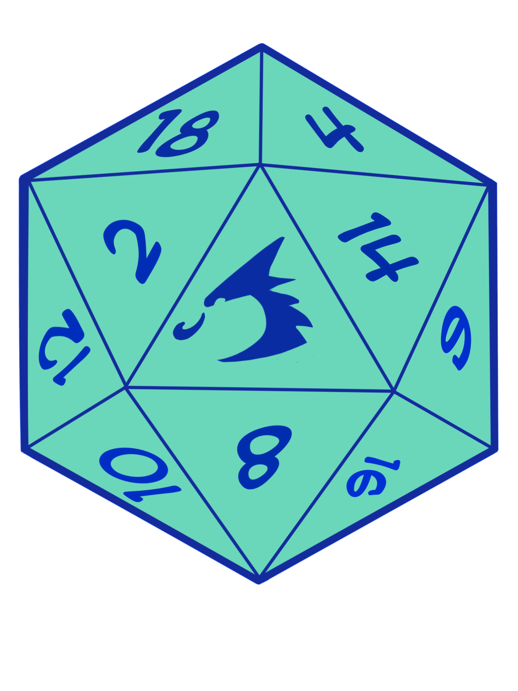
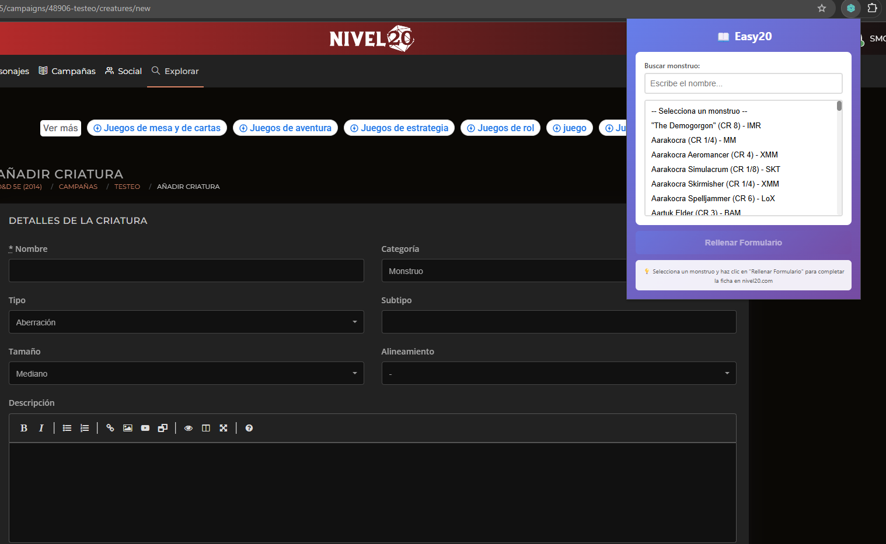
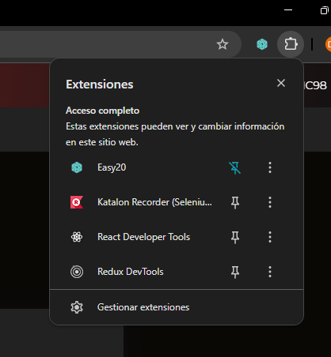
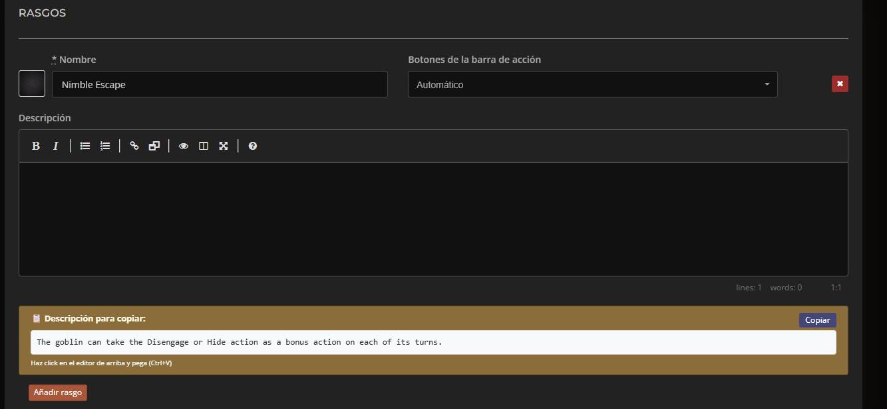

<!-- Header -->

  
  

    <a href="https://www.instagram.com/thirteight__?igsh=enBqMzhyaXRqNHc2&utm_source=qr">
      Ilustración hecha por el artista 38
    </a>
  

<h1>EASY20</h1>
Extensión para navegador que automatiza el rellenado de fichas de monstruos en <b>Nivel20</b>

Ahorra horas de trabajo manual importando criaturas de D&D con un solo click.

> **Aviso:** Esta extensión no es oficial ni está asociada a Nivel20, Wizards of the Coast o a alguno de sus terceros afiliados. Es un proyecto independiente para la comunidad.

---

## Novedades en v1.2

- **Bestiarios dinámicos**: oficiales de 5etools + homebrew (catálogo Giddy y URL propia)
- **Descubrimiento de fuentes**: si buscas una criatura y no aparece, Easy20 sugiere activar la fuente donde está
- **Rasgos y acciones en el editor**: relleno directo del editor de Nivel20 (EasyMDE/CodeMirror), con copy-paste de respaldo
- **Caché local**: IndexedDB para no redescargar bestiarios en cada sesión

Ver el [CHANGELOG](CHANGELOG.md) completo.

---

## Características

### Criaturas en segundos

Rellena automáticamente la mayoría de campos de la ficha de monstruo en Nivel20:

- ✅ Información básica (nombre, tipo, tamaño, alineamiento)
- ✅ Puntuaciones de característica (STR, DEX, CON, INT, WIS, CHA)
- ✅ Estadísticas de combate (CA, PG, CR, iniciativa)
- ✅ Velocidades (caminar, volar, nadar, etc.)
- ✅ Tiradas de salvación y habilidades
- ✅ Rasgos, acciones, acciones adicionales, reacciones (incluido texto en el editor)
- ✅ Acciones legendarias y acciones míticas
- ✅ Spellcasting
- ✅ Acciones de guarida / efectos regionales (cuando vienen de 5etools)

### Compatible con D&D 2024

Puedes traer criaturas de bestiarios de 5e a tu campaña de D&D 2024 o traer criaturas de bestiarios de 2024 a tu campaña de 5e.

### Bestiarios oficiales y homebrew

Easy20 carga criaturas en tiempo real desde **5etools** y homebrew del repositorio [Giddy](https://github.com/TheGiddyLimit/homebrew), con caché en IndexedDB. Si no hay red o fallan las fuentes remotas, usa el bestiario embebido como respaldo.

En la pestaña **Fuentes**:

1. **Oficiales** — activa manuales y aventuras (nombre completo + sigla; filtro por ambos)
2. **Añadir homebrew** — busca en el catálogo Giddy (solo packs con monstruos) o pega una URL de homebrew
3. **Homebrew instalado** — gestiona lo que ya tienes cargado
4. **Limpiar caché** — fuerza una nueva descarga de datos

Por defecto vienen activas fuentes básicas (p. ej. Monster Manual / XMM). El resto se activa bajo demanda.

### Descubrimiento al buscar

Si escribes un nombre y no está en las fuentes activas, Easy20 consulta el índice global de 5etools y te propone **activar la fuente** donde aparece la criatura.

### Búsqueda rápida

Encuentra monstruos entre todas las fuentes activas con búsqueda instantánea.

### Editor + copy-paste de respaldo

Las descripciones de rasgos y acciones se escriben en el editor de Nivel20. Si algo falla (cambio de la web, timeout), siguen apareciendo cajas de copy-paste para pegar a mano.

<em>Popup con búsqueda de monstruos y pestaña de fuentes</em>

---

## Instalación

### Instalación Manual

La extensión actualmente se distribuye de forma manual mientras se prepara para las stores oficiales.

#### Chrome / Edge / Brave

1. **Descarga** el código:
   - [Última release](../../releases/latest) (recomendado)
   - O clona el repositorio: `git clone https://github.com/smc98/easy20.git`

2. **Abre Chrome** y ve a `chrome://extensions/`

3. **Activa el "Modo de desarrollador"** (esquina superior derecha)

4. **Click en "Cargar extensión descomprimida"**

5. **Selecciona la carpeta** de la extensión

6. **¡Listo!** La extensión aparecerá en tu barra de herramientas

<em>Pinea la extensión si quieres tenerla a mano</em>

#### Firefox

1. **Descarga** el código (igual que Chrome)

2. **Abre Firefox** y ve a `about:debugging#/runtime/this-firefox`

3. **Click en "Cargar complemento temporal..."**

4. **Selecciona el archivo** `manifest.json` de la carpeta de la extensión

5. **¡Listo!** La extensión está activa

> **Nota Firefox:** Los complementos temporales se desinstalan al cerrar Firefox. **Próximamente** se proveerá un método de instalación persistente mediante XPI firmado.

---

### Instalación Persistente (Próximamente)

Estamos trabajando en métodos de distribución permanente:

- ✅ **Firefox XPI firmado** - Instalación permanente de la extensión en local

**Mantente informado** siguiendo el repositorio o uniéndote a las [Discussions](../../discussions).

---

## Uso

### 1. Abre Nivel20

Ve a [nivel20.com](https://nivel20.com) en una campaña que dirijas, pestaña **Bestiario** → **Crear Nuevo**.

### 2. Abre la extensión

Click en el icono de Easy20 en tu navegador.

### 3. (Opcional) Activa fuentes

En la pestaña **Fuentes**, marca los manuales que necesites o añade homebrew. La primera carga puede tardar unos segundos (luego se cachea).

### 4. Busca la criatura

En **Buscar**, escribe el nombre en inglés (ej: `Goblin`, `Ancient Red Dragon`). Si no aparece, mira el panel de sugerencias para activar su fuente.

### 5. Rellena el formulario

Click en **Rellenar Formulario** y espera a que terminen los rasgos (se añaden uno a uno).

### 6. Revisa y guarda

Comprueba el editor de rasgos/acciones. Si algún texto no se ve en el editor, usa la caja de **Respaldo** / **Copiar** junto al campo.

<em>Respaldo copy-paste si el editor no se actualiza</em>

---

## ⚠️ Aviso Legal

Ver [DISCLAIMER.md](DISCLAIMER.md) para información legal completa.

---

## Contribuir

¡Las contribuciones son bienvenidas! Este proyecto es de código abierto bajo licencia MIT. Si quieres desarrollar tu propia versión, solo te pido que acredites que tu proyecto está basado en este.

### Cómo Contribuir

1. **Fork** el repositorio
2. Crea una **rama** (`git checkout -b feature/AmazingFeature`)
3. **Commit** tus cambios (`git commit -m 'Add some AmazingFeature'`)
4. **Push** a la rama (`git push origin feature/AmazingFeature`)
5. Abre un **Pull Request**

### Áreas de Mejora

- **Campo de Idiomas**
- **Conjuros enlazados a Nivel20**
- **Filtros** (por CR, tipo, fuente)
- **Instalación persistente en Firefox** (XPI)

Ver [BUILD.md](BUILD.md) para la guía de desarrollo.

---

## Licencia

### Código Fuente - MIT License

El código de esta extensión está bajo [Licencia MIT](LICENSE).

Puedes:

- ✅ Usar libremente
- ✅ Modificar
- ✅ Distribuir
- ✅ Crear forks
- ✅ Contribuir

---

## Arquitectura Técnica

- **ES6 Modules** nativos (sin bundler)
- **Script injection** para Manifest V3
- **Servicios de bestiario** (`js/services/`) — carga remota, caché, homebrew, descubrimiento
- **Módulos de relleno** (`js/modules/`) — campos de la ficha en Nivel20
- **Compatible** Chrome + Firefox

Ver [BUILD.md](BUILD.md) para detalles técnicos.

## Créditos

- **D&D** — [Wizards of the Coast](https://dnd.wizards.com)
- **5etools** — Datos de bestiario oficial y formato JSON
- **TheGiddyLimit/homebrew** — Catálogo de homebrew
- **nivel20.com** — Plataforma de gestión de campañas
- **Comunidad open source** — Herramientas y librerías

---

## Soporte

- **Bugs:** [GitHub Issues](../../issues)
- **Ideas:** [GitHub Discussions](../../discussions)
- **Cambios:** [CHANGELOG.md](CHANGELOG.md)
- **Docs:** Ver archivos `.md` en el repo

---

## Roadmap

### Hecho en v1.2

- [x] Bestiarios dinámicos (oficial + homebrew)
- [x] Descubrimiento de fuentes al buscar
- [x] Relleno del editor EasyMDE/CodeMirror
- [x] Caché IndexedDB + fallback embebido

### Próximo

- [ ] Instalación persistente Firefox (XPI firmado)
- [ ] Filtros avanzados (CR, tipo, fuente)
- [ ] Campo de idiomas automatizado

---

**Desarrollado con ❤️ para la comunidad de D&D en español**

## Apoya el Proyecto

Si te ha sido útil esta extensión, considera <a href="https://ko-fi.com/smc98" target="_blank">
apoyar el proyecto </a>para que pueda seguir manteniéndolo y desarrollando nuevas ideas gratuitas para la comunidad.

